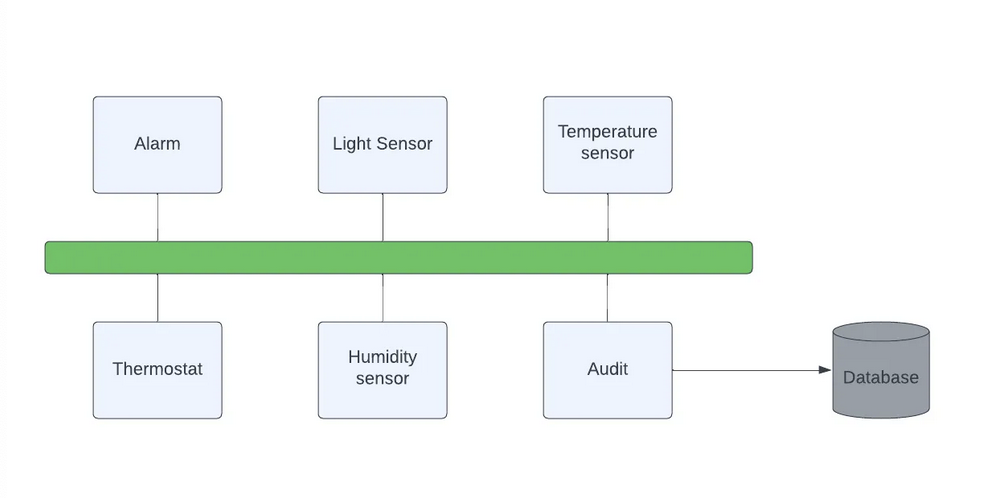
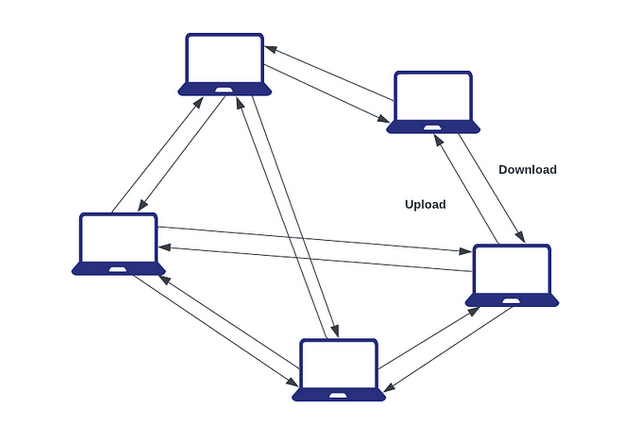

# Software Arcitectural Patterns
An overview and summary of fundamental software architectural patterns.

**Links**
- [Medium - Software Arcitectural Patterns](https://medium.com/@liams_o/fundamental-software-architectural-patterns-663440c5f9a5)

## Layers Pattern
Partition the system into separate layers, organised by related criteria. Upper layers can use lower layers but not the other way around (one way only). 

This pattern can be useful when collaborating with different teams, where a team can work on different modules/layers in parallel. 

## Client Server Pattern
Typical pattern used in the Internet. The consumers (clients) connect to servers. This allows the service to be distributed. User applications consume the data provided by the servers and are responsible for providing an interface to interact with them. This pattern has a strong separation of concerns and responsibilities

## Pipe and Filter Pattern
Each component named _filter_ is responsible for a single transformation or operation on the data. Data is streamed from one filter to the next as fast as possible and data operation occurs in parallel. The filters should be decoupled to allow re-use and easy swapping around to create new pipelines.

The _filter_ is the component which reads the data, transforms it and returns the transformed data

The _pipe_ is a connector that transports the data from one filter to the next and ensures that the data isn't modified along the way.

This pattern suits data analysis and data transformation use cases. It can be computationally expensive but can remove the workload from the consumers of the data as they have a clean set of data to work with.

## SOA Pattern (Service Oriented Arcitecture)
A typical implementation of this is a system made up of microservices. Independant components offer specific functionality which all together, define the behaviour of the system as a whole. 

For this to work, consumers of the services must be able to locate and use them without knowing the implementation details underlying them. 

More traditional implementations rely heavily on the SOAP protocol which works by exchanging XML messages.

The benefits of this pattern are interoperability and scalability but it comes at the price of complexity as there are many moving parts to a microservice which can be difficult to manage changes, while maintaining compatability. 

An over simplified example:

## Pub Sub Pattern
The publish-subscribe pattern sees data producers and consumers exist independently and are separatated by an event bus. Usually, multiple consumers subscribe to events which are published by multiple producers. Using an event bus makes the system asynchronous which is useful to systems which experience bursty traffic patterns. 

The benefits of this pattern is reusability and performance in the exchange of data. 

## Shared Data Pattern
Multiple components access data through a common data store. Multiple components add data to the datastore and it acts as a common medium for all consumers. Useful when multiple components require a large amount of data.

This is typically seen as part of larger systems like the SOA pattern described above. This pattern promotes reliability through data consistency as well as scalability and performance if the data is partitioned correctly. The downside is that if it's not architected correctly, it introduces a single point of failure.

## Peer-to-Peer P2P Pattern
Lacks the strict division of other patterns such as a the client/server. Instead, it belongs to the category of symmetric client-server patterns where a single system acts as both the client and the server. Useful for file sharing applications and implementation of cryptocurrency protocols. 

## Server Broker Pattern
Consists of 3 components: broker, server and client. It's useful for distributed systems with decoupled components. The broker is the message routing component for the system, it passes messages from the client to server and vice versa. These messages are requests for services and replies to those requests (as well as exceptions that have occurred). The broker is responsible for error handling in response to any exceptions. 

Servers publish their capabilities (services and characterristics) to a broker. Clients send requests to the broker and the broker routes the requests to the appropriate server. Some examples of broker services are Apache ActiveMQ, Kafka and RabbitMQ

This is a useful pattern to use if the relation to client-server is not fixed because there are many suitable servers or the availability of the servers changes over time. Also, if the choice of server depends on some criterion that is complex enough to be delegated to a separate component. 
