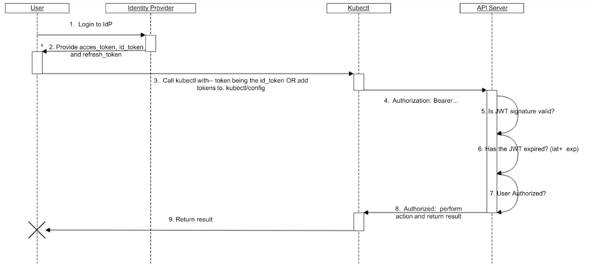
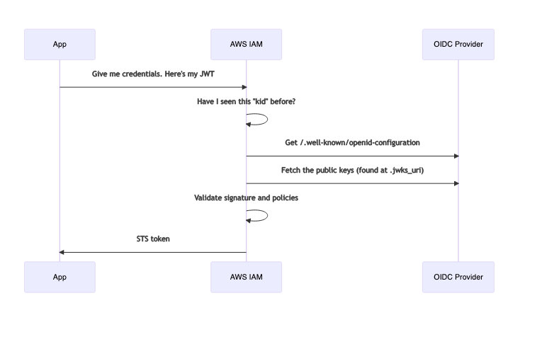

# Kubernetes and OIDC
(For notes on OAuth2 and OIDC, see notes on [oauth2-and-oidc](../../authentication/oauth2-and-oidc.md))

## Authentication
We'll look at how to authenticate with the Kube API server using OIDC.



1. User logs in to the Identity Provider
1. The IDP provides:
    1. Access Token
    1. ID Token (JWT)
    1. Refresh Token
1. User calls `kubectl`
1. Token info is sent along within the Auth: Bearer header
1. Kube API server verifies that the JWT token was signed by the IDP
1. Kube API server verifies the token isn't expired
1. Kube API server verifies the user is authorised to access the resource requested in the `kubectl` command.
1. Result returned from API to `kubectl` client
1. Return returned to user

- Kube API doesn't speak to the identity provider when this transaction happens. This is possible because the identity provider signed the token with their private key. 
- The API server has the public key (because this is something that is retrieved once in a while, seperate to this example flow).
- Using the public key of the identity provider, the API server is able to verify that the token was indeed signed by the **trusted** identity provider.

## Pods Using IAM Roles
This is covered in the [AWS Technical Docs](https://docs.aws.amazon.com/eks/latest/userguide/iam-roles-for-service-accounts-technical-overview.html) and [Best Practices Docs](https://aws.github.io/aws-eks-best-practices/security/docs/iam/#kubernetes-service-accounts)

Pods are able to gain the access that an IAM role grants by using service accounts. This feature is called "IAM Roles for Service Accounts" (IRSA). It works by leveraging a Kubernetes feature known as Service Account Token Volume Projection. 

AWS IAM supports federated identities using OIDC. This allows us to authenticate AWS API calls with a supported identity provider and recieve a valid OIDC JWT. This token can then be passed to the AWS STS `AssumeRoleWithWebIdentity` API operation and recieve IAM temporary role credentials.

EKS hosts a public OIDC discovery endpoint per cluster (eg: `https://oidc.eks.us-east-1.amazonaws.com/id/<guid-assigned-per-cluster>/.well-known/openid-configuration`) which contains the signing keys for the `ProjectedServiceAccountToken` JWTs, so external systems like IAM can validate and accept the OIDC tokens issued by Kubernetes.

## Technical Docs Summary
1. Service Accounts are associated with IAM roles by the `eks.amazonaws.com/role-arn` annotation in the Service Account spec.
1. The [Amazon EKS Pod Identity Webhook](https://github.com/aws/amazon-eks-pod-identity-webhook) on the cluster watches for pods that have this annotation and applies the following environment variables to them:
    1. `AWS_ROLE_ARN=<role-arn>`
    1. `AWS_WEB_IDENTITY_TOKEN_FILE=/var/run/secrets/eks.amazonaws.com/serviceaccount/token`
1. The Kubernetes API server will also call the public OIDC discovery endpoint for the cluster on startup. The public OIDC provider endpoint will look something like `https://oidc.eks.us-east-1.amazonaws.com/id/<guid-assigned-per-cluster>/.well-known/openid-configuration`.
1. The endpoint cryptographically signs the OIDC token, issued by Kubernetes
1. The resulting token is mounted as a volume.

## Best Practices Docs Summary
1. API server calls the Public OIDC discovery endpoint
1. The endpoint cryptographically signs the OIDC token issued by Kubernetes
1. The resulting token is mounted as a volume on the pod
1. This signed token allows the Pod to call the AWS APIs associated IAM role.
1. When the AWS API is invoked, the AWS SDKs call `sts:AssumeRoleWithWebIdentity`
1. After validating the token's signature, IAM exchanges the Kubernetes issued token for a temporary AWS Role Credential.
1. The [Amazon EKS Pod Identity Webhook](https://github.com/aws/amazon-eks-pod-identity-webhook) is a mutating webhook which runs as part of the EKS control plane and injects the following environment variables to pods which are using a service account which have the `eks.amazonaws.com/role-arn` annotation:
    1. `AWS_ROLE_ARN=<role-arn>`
    1. `AWS_WEB_IDENTITY_TOKEN_FILE=/var/run/secrets/eks.amazonaws.com/serviceaccount/token`
1. The kubelet will automatically rotate the projected token when it is older than 80% of its TTL or after 24 hours. The AWS SDKs are responsible for reloading the token when it rotates.

## Deep Dive Summary
This is good summation of what happens. The notes below are taken from [this blog](https://blog.mikesir87.io/2020/09/eks-pod-identity-webhook-deep-dive/)

As mentioned above, the mutating webhook adds the token env vars and projects a token volume to the pod based on the service account annotation. The env vars are used by the AWS SDKs to automatically assume the specified role. In order to work an OIDC provider is configured in IAM to trust the ServiceAccount tokens. 

### 1. OIDC Workflow
- The OIDC provider has a public discovery endpoint (eg `https://oidc.eks.us-east-1.amazonaws.com/id/<guid-assigned-per-cluster>/.well-known/openid-configuration`)
- The `<jwks_uri>` endpoint of the above, provides a JSON Web Key Set. This is a collection of public keys being used to sign tokens from the issuer.
- The OIDC provider is configured to ensure the token receiver doesn't trust just anyone.

1. A Client wants to authenticate with an API. It has a JWT token that identifies itself which has been signed by the trusted provider.
1. The API recieves the JWT and determines if it has the public key identified by the `kid` (Key ID) attribute in the JWT header. If it doesn't recognise the key, it:
    1. Fetches the OIDC config at the discovery endpoint
    1. Uses the `<jwks>` endpoint to get the provider's published public keys (the JWKS).
1. Once the API has the providers public key, it validates the signature of the token, expiration, audience claims (who it's intended for, aka Client ID), etc.
1. Once validated, the API can assure the claims in the token are valid

### 2. Creating an OIDC Provider
EKS will create an OIDC Provider URL when the cluster is created. This will have the public discovery endpoints and the jwks config but you'll still need to create an identity provider within the IAM console which specifies the `sts.amazonaws.com` audience.

### 3. OIDC with AWS IAM
Once we have the provider in IAM, we can configure AWS IAM to trust the tokens which have been generated by it. We want to allow the JWTs for a service account to obtain STS tokens for a particular role. We do this by creating a trust relationship on the desired role. 

The below example is authorising an IAM role to be assumed by a client that has a JWT token with a `sub` claim of `system:serviceaccount:mynamespace:hello-world-app` which is the service account called `hello-world-app` in the `mynamespace` namespace.

```json
{
  "Version": "2012-10-17",
  "Statement": [
    {
      "Effect": "Allow",
      "Principal": {
        "Federated": "arn:aws:iam::1234567890123:oidc-provider/my-oidc-provider.example.com"
      },
      "Action": "sts:AssumeRoleWithWebIdentity",
      "Condition": {
        "StringEquals": {
          "my-oidc-provider.example.com:sub": [
            "system:serviceaccount:default:hello-world-app"
          ]
        }
      }
    }
  ]
}
```

To express this as a sequence diagram:



### 4. Service Account Token/JWT
This section will answer _how_ the service account gets it's JWT. 

- Every pod by default as a service account JWT **but** the default service account has no `exp` (expiry) claim. Having a trusted JWT with no expiry would be a bad. This is the problem that the mutating webhook solves.
- The webhook leverages the [Service Account Token Volume Projection](https://kubernetes.io/docs/tasks/configure-pod-container/configure-service-account/#service-account-token-volume-projection) feature, which provides a pod with a newly created JWT that contains a specified audience and expiration. 
- The cluster will automatically rotate and update this token for as long as the pod is running
- In order to use this feature, the Kube API server needs to be configured with the following flags:
    - `--service-account-issuer`: The issuer name for the cluster (this is typically a full URI for the issuer)
    - `--service-account-signing-key-file`: A private key to be used with signing the JWTs
    - `--service-account-api-audiences`: A list of audiences allowed to be specified in projected volumes. These also serve as defaults if no specific audience is indicated in mount config.
- The webhook also injects a couple of environment variables:
    1. `AWS_ROLE_ARN=<role-arn>`
    1. `AWS_WEB_IDENTITY_TOKEN_FILE=/var/run/secrets/eks.amazonaws.com/serviceaccount/token`
- If we looked at this JWT, it'd look something like this:

```json
{
  "aud": ["aws-iam"],
  "exp": 1600956419,
  "iat": 1600870019,
  "iss": "https://my-oidc-provider.example.com",
  "kubernetes.io": {
    "namespace": "default",
    "pod": {
      "name": "test-iam-pod",
      "uid": "0b65077b-336d-442c-8c47-09ac8bed4b26"
    },
    "serviceaccount": {
      "name": "hello-world-app",
      "uid": "635ee15d-8b81-499e-bde0-093a3b0612ec"
    }
  },
  "nbf": 1600870019,
  "sub": "system:serviceaccount:mynamespace:hello-world-app"
}
```
Note that it contains an `exp` and the name of the Service Account assigned to the pod

AWS SDKs (since around the end of 2019) have been configured to automatically use the configuration specified in the `AWS_ROLE_ARN` and `AWS_WEB_IDENTITY_TOKEN_FILE`. So if the webhook has injected these into the pod (and the token passes the verify steps) then the pod will be able to assume the IAM role with a set of temporary credentials.


## AWS Deep Dive
These are notes taken from [AWS Deep Diving Into IAM roles](https://aws.amazon.com/blogs/containers/diving-into-iam-roles-for-service-accounts/)

### Kubernetes Service Accounts
Service Accounts are how pods are given an identity. When a Service Account is created, a JWT token is automatically created as a Kubernetes Secret. This Secret can then be mounted into Pods and used by that Service Account to authenticate to the Kubernetes API Server.

The token created for the default service account isn't suitable for OIDC authentication because it's missing an expiry date and only the Kubernetes API Server can validate it.

Since v1.12, the Kubernetes `ProjectedServiceAccountToken` feature was introduced. This feature allows a fully compliant OIDC JWT issued by the TokenRequest API of Kubernetes to be mounted into the Pod as a Projected Volume. (The relevant Service Account Token Volume Projection flags are enabled by default on an EKS cluster). Therefore, fully compliant OIDC JWT Service Account tokens are being projected into each pod.

An example of such a token looks like this:

```json
{
  "header": {
    "alg": "RS256",
    "kid": "689de1734321bcfdfbef825503a5ead235981e7a"
  },
  "payload": {
    "aud": [
      "https://kubernetes.default.svc"
    ],
    "exp": "2023-02-18T16:37:58+00:00",
    "iat": "2022-02-18T16:37:58+00:00",
    "iss": "https://oidc.eks.us-east-2.amazonaws.com/id/xxxx",
    "kubernetes.io": {
      "namespace": "default",
      "pod": {
        "name": "eks-iam-test2",
        "uid": "cd953361-41a2-4de0-b799-51f169920741"
      },
      "serviceaccount": {
        "name": "default",
        "uid": "5af7481a-2c9c-4613-9266-1037a23961a4"
      },
      "warnafter": 1645205885
    },
    "nbf": "2022-02-18T16:37:58+00:00",
    "sub": "system:serviceaccount:default:default"
  }
}
```

This alone is not enough to speak to AWS APIs. A second token is required to be present in the pods. This is where AWS's [mutating webhook](https://github.com/aws/amazon-eks-pod-identity-webhook/) comes into play. This webhook comes preinstalled in an EKS cluster and listens to **Create pod** API calls and can inject an additional token into our pods. 

For the webhook to inject a new Token into our Pod, we need a new service account with the proper annotations which specify the AWS IAM Role ARN and then we need to reference the Service Account in our pod. 

When a Pod is using the above mentioned service acccount, an additional volume mount is created via the mutating webhook. The token is still being generated by the Kuberentes API server but with a new OIDC JWT audience (`sts.amazonaws.com`)

An example of such a token:
```json
{
  "header": {
    "alg": "RS256",
    "kid": "689de1734321bcfdfbef825503a5ead235981e7a"
  },
  "payload": {
    "aud": [
      "sts.amazonaws.com"
    ],
    "exp": "2022-02-19T16:43:55+00:00",
    "iat": "2022-02-18T16:43:55+00:00",
    "iss": "https://oidc.eks.us-east-2.amazonaws.com/id/xxxx",
    "kubernetes.io": {
      "namespace": "default",
      "pod": {
        "name": "eks-iam-test3",
        "uid": "6fd2f65f-4554-4317-9343-c8e5d28029c3"
      },
      "serviceaccount": {
        "name": "my-sa",
        "uid": "2c935d89-3ff0-425d-85c2-8236a6d626aa"
      }
    },
    "nbf": "2022-02-18T16:43:55+00:00",
    "sub": "system:serviceaccount:default:my-sa"
  }
}
```

**Note** example command to read the token:
```bash
jwt decode $(kubectl exec -it eks-iam-test3 -- cat /var/run/secrets/eks.amazonaws.com/serviceaccount/token) --json --iso8601
```

The important parts of this token are:
- The intended audience is `sts.amazonaws.com`
- The issuer is still the cluster's OIDC provider
- The expiration date is 24 hours (this is the default, it can be modified via an annotation to the service account)

The mutating webhook does more than just mount the additional token, it also injects the the environment variables by adding them to the pod spec:

```json
[
  {
    "name": "AWS_DEFAULT_REGION",
    "value": "us-east-2"
  },
  {
    "name": "AWS_REGION",
    "value": "us-east-2"
  },
  {
    "name": "AWS_ROLE_ARN",
    "value": "arn:aws:iam::111122223333:role/eksctl-eks-oidc-demo-addon-iamserviceaccount-Role1-1SJZ3F7H39X72"
  },
  {
    "name": "AWS_WEB_IDENTITY_TOKEN_FILE",
    "value": "/var/run/secrets/eks.amazonaws.com/serviceaccount/token"
  }
]
```

These environment variables are used by the AWS SDks when assuming a role from a web identity. 

Now, we have a Service Account which provides the pod with an OIDC compliant JWT token which has an audience of `sts.amazonaws.com`, we need to configure IAM to _trust_ these tokens. IAM supports federated identities using OIDC identity providers. This allows IAM to authenticate AWS API calls with supported identity providers after recieving a valid OIDC JWT. This token can then be passed to the AWS STS `AssumeRoleWithWebIdentity` API operation to get temporary IAM credentials. 

The OIDC JWT token we have from the Kubernetes TokenRequest API is cryptographically signed and IAM should trust and validate these tokens before the `AssumeRoleWithWebIdentity` operation sends temporary credentials. EKS hosts a public OpenID provider configuiration document along with the public keys to validate the token signature (eg `https://oidc.eks.us-east-1.amazonaws.com/id/<guid-assigned-per-cluster>/.well-known/openid-configuration`). The publics keys are used by the IAM server, to verify the token was signed by a trusted source (eg only the public key can decrypt something which has been encrypted by the private key, therefore this proves it was signed by an entity which has access to the private key).

In order to accept the token from a Pod, there has to be a trust between IAM and the OIDC provider. This is done via the IAM console under "Identity Providers". The relevant settings here are:
- OIDC provider endpoint URL (can be found on the EKS cluster details page)
- Audience (`sts.amazonaws.com`) (this further validates the token is intended for the STS APIs)
- Thumbprint (used in the EKS console)
